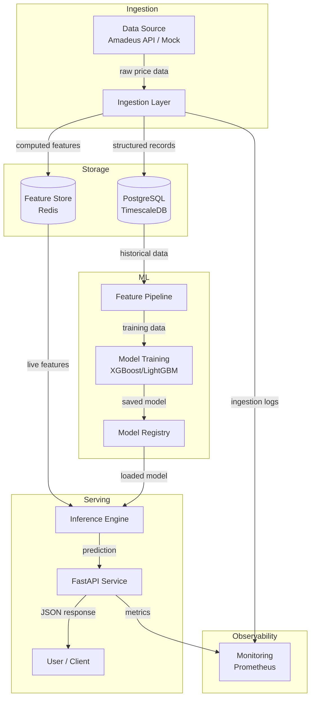

# Flight Price Predictor — Architecture

## System Overview

This document maps the architecture of the flight price forecasting system.
It is updated as each component is built.

## Current State
> Last updated: Step 2 — Ingestion Layer

## Architecture Diagram

## Component Status

| Component | Status | Notes |
|---|---|---|
| Repo setup | ✅ Complete | Poetry, pyenv, CI/CD, branch protection |
| Data ingestion | 🔄 In progress | Mock data layer, Amadeus pending |
| Feature pipeline | ⬜ Not started | |
| Model training | ⬜ Not started | |
| Serving API | ⬜ Not started | |
| Monitoring | ⬜ Not started | |

## Data Flow

### Ingestion
- Runs on a schedule (every hour)
- Pulls price observations for configured routes
- Stores raw records in PostgreSQL

### Feature Pipeline
*(to be filled in)*

### Model Training
*(to be filled in)*

### Serving
*(to be filled in)*